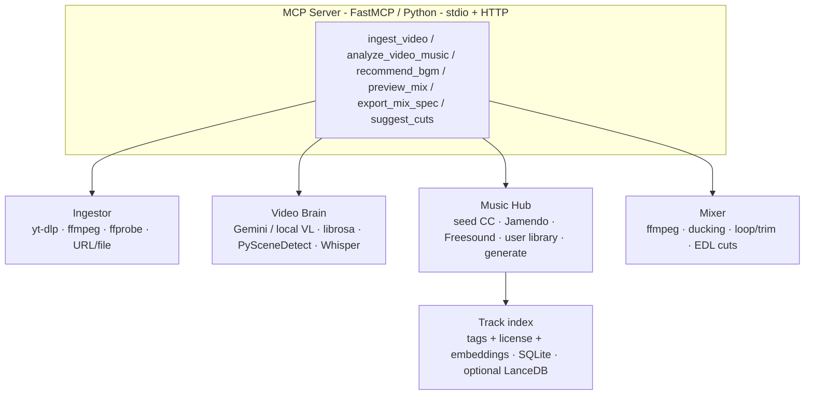

# Sonicmatch

<!-- mcp-name: io.github.js713-lab/sonicmatch-mcp -->

[](https://www.python.org/downloads/)
[](LICENSE)
[](https://github.com/js713-lab/sonic-match-mcp/stargazers)

**Video-native MCP server for license-safe BGM.** Watches the footage — not the script — and returns a shortlist, a 12–20s hook, and an ffmpeg ducking spec.

<p align="center">
  
</p>

Package / CLI: [`sonicmatch-mcp`](https://github.com/js713-lab/sonic-match-mcp). A [Model Context Protocol](https://modelcontextprotocol.io) server for Claude Desktop, Cursor, and other MCP clients. Drop an Instagram Reel, YouTube Short, or TikTok-style clip. Get royalty-free / Creative Commons matches with the license printed on every row.

Video-to-BGM already exists. The wedge is not “I also match music”:

- it watches the **footage**, not the script
- it returns a **hook window** + ffmpeg ducking spec
- it is **agent-native**
- it **prints the license** instead of lying

Catalog quality will kill or save this. More tools will not.

```
Video or URL in
  → scene / mood / pace / speech analysis
  → license-safe BGM shortlist
  + beat/cut hints
  + optional mix preview
```

Do **not** treat this as “script in → YouTube Music search out.” That already exists (`mcp-bgm-recommender`). Sonicmatch watches the **video**.

| You own | You do not own |
|---|---|
| Local file / public URL ingest | Platform music licenses |
| Mood, energy curve, speech vs silence, scene cuts | Meta/TikTok “trending audio” graph |
| CC / royalty-free catalogs + optional paid adapters | Spotify / IG official libraries |
| Ranked tracks, preview URLs, mix spec, ffmpeg | Auto-publish to Instagram |

**North star:** `ingest_video` → `analyze_video_music` → `recommend_bgm` → `preview_mix` → `export_mix_spec`

## License warning (read this)

- The **code** is MIT.
- **Every track has its own license.** It is printed on every recommendation.
- Nothing here is an official Instagram sticker, TikTok Commercial Music Library track, or YouTube Audio Library API result.
- Do not recommend commercial pop unless the adapter is explicitly a **user-owned licensed library**.
- CC-BY still needs attribution. CC-BY-NC is **not** ok for ads / shops. Non-commercial tracks are **never auto-recommended**.
- For ads / shops, wire a **user-owned** Artlist / Epidemic JSON (`examples/user_library.example.json`). Do not scrape those sites.
- Content ID can still hit you if you point at the wrong source. A CC label is not a waiver.

## Demo

> I dropped `./clip.mp4`. Analyze it for an Instagram Reel and recommend 5 instrumental BGMs. Then mix the top pick with ducking and give me the ffmpeg command.

That prompt is the product. Install below, wire Claude Desktop or Cursor, paste it.

## Quick start

Requires **Python 3.10+** and `ffmpeg` / `ffprobe` on PATH. `yt-dlp` is optional and **off by default** (`SONICMATCH_ALLOW_YTDLP=0`) because platform extractors break and may violate ToS. Prefer a local file.

```bash
pip install git+https://github.com/js713-lab/sonic-match-mcp.git
sonicmatch-mcp            # or: python3 -m sonicmatch
```

With [uv](https://github.com/astral-sh/uv), no clone:

```bash
uvx --from git+https://github.com/js713-lab/sonic-match-mcp.git sonicmatch-mcp
```

From a clone (editable + tests):

```bash
git clone https://github.com/js713-lab/sonic-match-mcp.git
cd sonic-match-mcp
python3 -m venv .venv
source .venv/bin/activate
pip install -e ".[dev]"
cp .env.example .env   # optional keys

# stdio (Claude Desktop / Cursor)
sonicmatch-mcp

# streamable HTTP (web editors)
sonicmatch-mcp --http --port 8765
```

```bash
# same clone, uv
uv venv && uv pip install -e ".[dev]"
uv run sonicmatch-mcp
```

v0.2 works **offline-ish** with a 20-track seed catalog aimed at Reel editors (cafe, product, talking-head, travel, food, fashion, event). Gemini, Jamendo, and Freesound are optional and degrade with a note in the tool response. Seed rows have no hosted audio on purpose — `preview_mix` synthesizes a demo bed. For real ads, point `SONICMATCH_LIBRARY_PATH` / `EPIDEMIC_LIBRARY_PATH` / `ARTLIST_LIBRARY_PATH` at JSON you already licensed.

```bash
pytest   # generates tiny color mp4s with ffmpeg
```

Not on PyPI yet. Install from git.

## Features

- **Watches the picture.** Gemini video understanding when `GEMINI_API_KEY` is set; otherwise local ffmpeg / audio heuristics (optional Whisper, PySceneDetect, librosa).
- **License on every row.** CC / royalty-free / user-owned library. Non-commercial tracks are never auto-recommended. Generated beds stay out of auto recs.
- **Editor-shaped output.** 12–20s hook in/out, speech ducking, ffmpeg recipe, mix spec for CapCut / Premiere / DaVinci / your agent.
- **Agent-native MCP.** stdio for Claude Desktop and Cursor; streamable HTTP for web editors. Never ships raw multi-MB video through the payload — you get an `asset_id`.
- **Works without API keys.** 20-track seed catalog for Reels. Optional Jamendo, Freesound, and user-owned Artlist / Epidemic JSON.
- **Cuts on the beat.** `suggest_cuts` snaps scene cuts to a BPM grid and returns EDL-ish intro / peak / outro.
- **Brand lock.** Save BPM / mood / no-vocals kits and pass `brand_kit=…` into `recommend_bgm`.
- **Series, not one-offs.** `analyze_batch` (max 20) clusters mood and returns one shared mini-playlist.
- **Honest about closed graphs.** No fake “trending audio,” official IG stickers, or Content-ID-safe stamps. yt-dlp platform ingest is opt-in.

## Tools

| Tool | What it does |
|---|---|
| `status` | ffmpeg / keys / seed count / day-1 risk gates |
| `ingest_video` | Local path or HTTPS URL → `asset_id` (never video bytes). Platform URLs need `SONICMATCH_ALLOW_YTDLP=1` |
| `analyze_video_music` | Mood, energy curve, speech, scenes, hook window, BPM, search queries |
| `recommend_bgm` | 3–7 ranked tracks + why + license + hook in/out |
| `search_music` | Free-text / BPM / mood over seed + optional catalogs |
| `get_track` | One track’s metadata, license, attribution, URLs |
| `preview_mix` | Hook trim, loop, optional ducking → preview files + ffmpeg + mix spec |
| `export_mix_spec` | Mix spec + ffmpeg + attribution (no render unless `render=true`) |
| `suggest_cuts` | Beat grid, snapped scene cuts, EDL, intro / peak / outro |
| `generate_bed` | Demo bed marked `source=generated`. Requires `i_understand_not_commercially_cleared=true` |
| `save_brand_kit` | Persist BPM / moods / no-vocals for `recommend_bgm(brand_kit=…)` |
| `analyze_batch` | Up to 20 clips → mood cluster + shared mini-playlist |

Also ships a prompt template: **“Score this video like an IG music sticker.”**

### Product rules (Instagram-like, not Instagram)

- Prefer **instrumental** when `speech_coverage > 0.25`
- Recommend a **hook window**, not the whole song
- Show **why** (`cuts at 0.8s average, 112 BPM, warm gold hour`)
- Always return **license + attribution text**
- 3–7 tracks, not 40
- User can override mood / genre / no-lyrics / platform / energy
- Never claim “cleared for Instagram official sticker” unless it actually is

## Claude Desktop

`claude_desktop_config.json` — after a clone + `pip install -e .`:

```json
{
  "mcpServers": {
    "sonicmatch": {
      "command": "/absolute/path/to/sonic-match-mcp/.venv/bin/sonicmatch-mcp",
      "args": [],
      "env": {
        "GEMINI_API_KEY": "",
        "JAMENDO_CLIENT_ID": "",
        "FREESOUND_API_KEY": ""
      }
    }
  }
}
```

After `pip install git+https://github.com/js713-lab/sonic-match-mcp.git`, `command` can be `sonicmatch-mcp` if that binary is on PATH.

## Cursor

`.cursor/mcp.json` (project) or `~/.cursor/mcp.json`. From git, no clone:

```json
{
  "mcpServers": {
    "sonicmatch": {
      "command": "uvx",
      "args": [
        "--from",
        "git+https://github.com/js713-lab/sonic-match-mcp.git",
        "sonicmatch-mcp"
      ],
      "env": {
        "GEMINI_API_KEY": "",
        "JAMENDO_CLIENT_ID": "",
        "FREESOUND_API_KEY": ""
      }
    }
  }
}
```

From a clone: `"command": "uv", "args": ["--directory", "/absolute/path/to/sonic-match-mcp", "run", "sonicmatch-mcp"]`. After `pip install`, `"command": "python3", "args": ["-m", "sonicmatch"]` works if that interpreter has the package.

Copy-paste configs: [`examples/claude_desktop.mcp.json`](examples/claude_desktop.mcp.json), [`examples/cursor.mcp.json`](examples/cursor.mcp.json). User-owned Epidemic/Artlist JSON shape: [`examples/user_library.example.json`](examples/user_library.example.json). Registry metadata: [`server.json`](server.json).

HTTP editors can point at `http://127.0.0.1:8765/mcp` after `sonicmatch-mcp --http`.

`--http` has no authentication. Keep it on loopback. The Docker image binds `0.0.0.0` so the container port works — do not publish that port to the internet. See [SECURITY.md](SECURITY.md).

## Architecture



Hard rule: **never send raw multi-MB video through the MCP payload.** Store locally, pass an `asset_id`. Loopback, `file://`, and private IPs are rejected (SSRF).

## VideoSonic profile

Analysis returns structured JSON, not a paragraph:

```json
{
  "duration_sec": 18.4,
  "aspect": "9:16",
  "content_type": "lifestyle",
  "has_speech": true,
  "speech_coverage": 0.62,
  "existing_music": false,
  "overall_mood": ["warm", "playful"],
  "energy_mean": 0.62,
  "energy_curve": [{"t": 0, "energy": 0.3}, {"t": 4, "energy": 0.8}],
  "pacing": "fast-cut",
  "scenes": [{"start": 0, "end": 3.2, "description": "cafe exterior", "energy": 0.4}],
  "hook_window": [9.0, 15.0],
  "suggested_bpm": [95, 118],
  "avoid": ["dark cinematic drone", "aggressive trap", "lyrics-dense"],
  "search_queries": ["warm acoustic pop instrumental cafe"],
  "platform_hint": "instagram_reel",
  "analyzer": "local"
}
```

- **Primary:** Gemini video understanding when `GEMINI_API_KEY` is set.
- **Fallback:** ffmpeg scene cuts + WAV energy / silence / ZCR heuristics. Optional `faster-whisper`, `scenedetect`, `librosa` if installed (`pip install 'sonicmatch-mcp[local-vl]'`).

## Music hub

Pluggable, license-first. v0 ships:

| Adapter | When | License reality |
|---|---|---|
| **Seed catalog** (`data/seed_tracks.json`) | always | 20 CC0 / CC-BY Reel beds + a vocal fixture + a CC-BY-NC fixture (NC is never auto-recommended) |
| **Jamendo** | `JAMENDO_CLIENT_ID` | CC, check commercial |
| **Freesound** | `FREESOUND_API_KEY` | CC, good for beds/loops not songs |
| **User library JSON** | `SONICMATCH_LIBRARY_PATH` / `EPIDEMIC_LIBRARY_PATH` / `ARTLIST_LIBRARY_PATH` | **you** already licensed it; we do not scrape paid sites |
| **Generate** | `generate_bed` | always `source=generated`; local sine demo unless you swap a real model |

Ranking (weighted): mood/energy → instrumental if speech → duration/loop → BPM vs cut rate → license fit → tag embedding cosine → user constraints. `recommend_bgm` drops non-commercial and generated tracks instead of downranking them.

Tracks are indexed in SQLite (`~/.cache/sonicmatch-mcp/db/tracks.sqlite`) with a 24-d tag embedding. If `lancedb` is installed (`pip install 'sonicmatch-mcp[embeddings]'`), vectors are also upserted there.

Seed tracks have no remote audio files on purpose (you should host files you actually have the rights to). `preview_mix` synthesizes a CC0 demo bed so the mixer still runs offline. `generate_bed` is a catalog-miss fallback and is **not** cleared for ads.

## Docker

```bash
docker build -t sonicmatch-mcp .
# Loopback-only publish. The process inside the container has no HTTP auth.
docker run --rm -p 127.0.0.1:8765:8765 -v sonic-cache:/data/cache sonicmatch-mcp
```

## Roadmap

Catalog > new tools.

- [x] Freesound adapter (loops / beds)
- [x] Tag embeddings in SQLite (+ optional LanceDB extra)
- [x] Epidemic Sound / Artlist as **user-owned JSON** plugins (no scrape)
- [x] Beat-grid vs scene-cut suggestions (EDL-ish `suggest_cuts`)
- [x] MCP registry listing (`server.json`)
- [x] Generate tool, marked `source=generated` (local demo; swap a real model at your own legal risk)
- [x] Official MCP registry listing via GitHub Release MCPB (see [PUBLISH.md](PUBLISH.md))
- [x] Non-commercial licenses excluded from auto `recommend_bgm`
- [ ] 20 seed beds a Reel editor would actually keep, with audio you host
- [ ] User-owned Artlist / Epidemic JSON as the default path for ads
- [ ] Real CLAP audio embeddings
- [ ] PyPI release

## Why this can be a good open-source project

**Yes if** you nail: (1) video-native analysis, (2) license honesty on every row, (3) editor-shaped output (hook in/out, ducking, mix spec), (4) a catalog someone would keep.

**No if** you only wrap YouTube Music search, or if the first five recs sound like leftover stock beds.

Day-1 risk gates (enforced in code, not slogans):

| Risk | Gate |
|---|---|
| **Content ID** | Every rec/search/get_track includes `content_id_warning`. CC/RF is never "Content-ID-safe". `content_id_risk` is `unknown` or `likely`, never `cleared`. |
| **yt-dlp ToS / broken extractors** | Platform URL ingest is off unless `SONICMATCH_ALLOW_YTDLP=1`. Failures map to `YTDLP_EXTRACTOR` and tell you to pass a local file. |
| **Upload size / SSRF** | HTTPS-only remote ingest, no `file://` / loopback / private IPs, `SONICMATCH_MAX_DOWNLOAD_MB` (default 200) on files, HTTP, and yt-dlp `--max-filesize`. |
| **“Trending” is a closed Meta graph** | Queries for trending/viral/IG audio/TikTok sound return empty + `TRENDING_UNAVAILABLE`. `recommend_bgm` always sets `trending_available=false`. |
| **Generation-model commercial terms** | `generate_bed` refuses unless `i_understand_not_commercially_cleared=true`. Generated tracks are excluded from auto `recommend_bgm`. |

## Use cases

IG Reel / Story · Shopee product clip · YouTube Shorts agent · CapCut/Premiere companion · campus recap · podcast clipper · travel-vlog batch · brand-kit lock (BPM + no vocals) · silent-film / accessibility · multi-agent studio.

## License

MIT. Track licenses are independent of the repo license. Security reports: [SECURITY.md](SECURITY.md).

From [CodeCrafter](https://codecrafter.dev).
