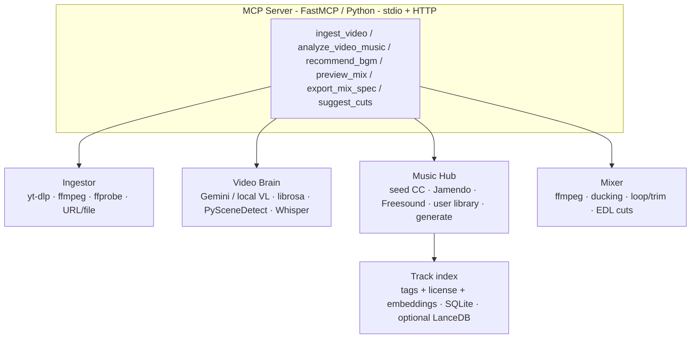

# sonicmatch-mcp

<!-- mcp-name: io.github.js713-lab/sonicmatch-mcp -->

Open-source **MCP server** that recommends **license-safe background music** the way Instagram Stories / Reels *feel*: drop footage, get a shortlist that already matches energy, then pick a 15s hook.

Source: [js713-lab/sonic-match-mcp](https://github.com/js713-lab/sonic-match-mcp). The installable package and CLI are named `sonicmatch-mcp`.

This is **infrastructure for editors and agents**, not another music chatbot.

```
Video or URL in
  → scene / mood / pace / speech analysis
  → license-safe BGM shortlist
  + beat/cut hints
  + optional mix preview
```

Do **not** treat this as “script in → YouTube Music search out.” That already exists (`mcp-bgm-recommender`). Sonicmatch watches the **video**.

| You own | You do not own |
|---|---|
| Local file / public URL ingest | Platform music licenses |
| Mood, energy curve, speech vs silence, scene cuts | Meta/TikTok “trending audio” graph |
| CC / royalty-free catalogs + optional paid adapters | Spotify / IG official libraries |
| Ranked tracks, preview URLs, mix spec, ffmpeg | Auto-publish to Instagram |

**North star:** `ingest_video` → `analyze_video_music` → `recommend_bgm` → `preview_mix` → `export_mix_spec`

## License warning (read this)

- The **code** is MIT.
- **Every track has its own license.** It is printed on every recommendation.
- Nothing here is an official Instagram sticker, TikTok Commercial Music Library track, or YouTube Audio Library API result.
- Do not recommend commercial pop unless the adapter is explicitly a **user-owned licensed library**.
- CC-BY still needs attribution. CC-BY-NC is **not** ok for ads / shops. Content ID can still hit you if you point at the wrong source.

## Quick start

Requires Python 3.10+ and `ffmpeg` / `ffprobe` on PATH. `yt-dlp` is optional and **off by default** (`SONICMATCH_ALLOW_YTDLP=0`) because platform extractors break and may violate ToS. Prefer a local file.

```bash
git clone https://github.com/js713-lab/sonic-match-mcp.git
cd sonic-match-mcp
python3 -m venv .venv
source .venv/bin/activate
pip install -e ".[dev]"
cp .env.example .env   # optional keys

# stdio (Claude Desktop / Cursor)
sonicmatch-mcp

# streamable HTTP (web editors)
sonicmatch-mcp --http --port 8765
```

With [uv](https://github.com/astral-sh/uv):

```bash
uv venv && uv pip install -e ".[dev]"
uv run sonicmatch-mcp
```

v0.2 works **offline-ish** with the checked-in seed catalog. Gemini, Jamendo, and Freesound are optional and degrade with a note in the tool response.

```bash
# tests (generates tiny color mp4s with ffmpeg)
pytest
```

### Example agent prompt

> I dropped `./clip.mp4`. Analyze it for an Instagram Reel and recommend 5 instrumental BGMs. Then mix the top pick with ducking and give me the ffmpeg command.

## Claude Desktop

`claude_desktop_config.json`:

```json
{
  "mcpServers": {
    "sonicmatch": {
      "command": "/absolute/path/to/sonicmatch-mcp/.venv/bin/sonicmatch-mcp",
      "args": [],
      "env": {
        "GEMINI_API_KEY": "",
        "JAMENDO_CLIENT_ID": "",
        "FREESOUND_API_KEY": ""
      }
    }
  }
}
```

## Cursor

`.cursor/mcp.json` (project) or `~/.cursor/mcp.json`:

```json
{
  "mcpServers": {
    "sonicmatch": {
      "command": "uv",
      "args": ["--directory", "/absolute/path/to/sonicmatch-mcp", "run", "sonicmatch-mcp"]
    }
  }
}
```

Copy-paste configs live in `examples/claude_desktop.mcp.json` and `examples/cursor.mcp.json`. User-owned Epidemic/Artlist JSON shape: `examples/user_library.example.json`. Registry metadata: `server.json`.

HTTP editors can point at `http://127.0.0.1:8765/mcp` after `sonicmatch-mcp --http`.

## Architecture



Hard rule: **never send raw multi-MB video through the MCP payload.** Store locally, pass an `asset_id`. Loopback, `file://`, and private IPs are rejected (SSRF).

## MCP tools

| Tool | Input | Output |
|---|---|---|
| `status` | — | ffmpeg / keys / seed count |
| `ingest_video` | local path or HTTPS URL, `max_seconds=180` | `asset_id`, duration, probe, keyframe paths. Platform URLs need `SONICMATCH_ALLOW_YTDLP=1` |
| `analyze_video_music` | `asset_id` + platform + notes | VideoSonic profile |
| `recommend_bgm` | profile or `asset_id` + prefs + `brand_kit` | 3–7 ranked tracks + reasons + license + hook in/out |
| `search_music` | free text / bpm / mood | catalog hits |
| `get_track` | id | metadata + license + urls |
| `preview_mix` | `asset_id` + `track_id` + ducking | preview files + ffmpeg recipe + mix spec |
| `export_mix_spec` | `asset_id` + `track_id` + `render?` | mix spec + ffmpeg + attribution (no render unless asked) |
| `suggest_cuts` | `asset_id` + optional bpm/track | beat grid, snapped scene cuts, EDL, intro/peak/outro |
| `generate_bed` | prompt / bpm / duration + `i_understand_not_commercially_cleared=true` | `source=generated` track (not catalog-cleared; excluded from auto recs) |
| `save_brand_kit` | BPM / moods / no-vocals | persisted kit name for `recommend_bgm(brand_kit=…)` |
| `analyze_batch` | list of paths/URLs (max 20) | mood cluster + shared mini-playlist |

Also ships a prompt template: **“Score this video like an IG music sticker.”**

### Product rules (Instagram-like, not Instagram)

- Prefer **instrumental** when `speech_coverage > 0.25`
- Recommend a **hook window**, not the whole song
- Show **why** (`cuts at 0.8s average, 112 BPM, warm gold hour`)
- Always return **license + attribution text**
- 3–7 tracks, not 40
- User can override mood / genre / no-lyrics / platform / energy
- Never claim “cleared for Instagram official sticker” unless it actually is

## VideoSonic profile

Analysis returns structured JSON, not a paragraph:

```json
{
  "duration_sec": 18.4,
  "aspect": "9:16",
  "content_type": "lifestyle",
  "has_speech": true,
  "speech_coverage": 0.62,
  "existing_music": false,
  "overall_mood": ["warm", "playful"],
  "energy_mean": 0.62,
  "energy_curve": [{"t": 0, "energy": 0.3}, {"t": 4, "energy": 0.8}],
  "pacing": "fast-cut",
  "scenes": [{"start": 0, "end": 3.2, "description": "cafe exterior", "energy": 0.4}],
  "hook_window": [9.0, 15.0],
  "suggested_bpm": [95, 118],
  "avoid": ["dark cinematic drone", "aggressive trap", "lyrics-dense"],
  "search_queries": ["warm acoustic pop instrumental cafe"],
  "platform_hint": "instagram_reel",
  "analyzer": "local"
}
```

- **Primary:** Gemini video understanding when `GEMINI_API_KEY` is set.
- **Fallback:** ffmpeg scene cuts + WAV energy / silence / ZCR heuristics. Optional `faster-whisper`, `scenedetect`, `librosa` if installed (`pip install 'sonicmatch-mcp[local-vl]'`).

## Music hub

Pluggable, license-first. v0 ships:

| Adapter | When | License reality |
|---|---|---|
| **Seed catalog** (`data/seed_tracks.json`) | always | CC0 / CC-BY you control |
| **Jamendo** | `JAMENDO_CLIENT_ID` | CC, check commercial |
| **Freesound** | `FREESOUND_API_KEY` | CC, good for beds/loops not songs |
| **User library JSON** | `SONICMATCH_LIBRARY_PATH` / `EPIDEMIC_LIBRARY_PATH` / `ARTLIST_LIBRARY_PATH` | **you** already licensed it; we do not scrape paid sites |
| **Generate** | `generate_bed` | always `source=generated`; local sine demo unless you swap a real model |

Ranking (weighted): mood/energy → instrumental if speech → duration/loop → BPM vs cut rate → license fit → tag embedding cosine → user constraints.

Tracks are indexed in SQLite (`~/.cache/sonicmatch-mcp/db/tracks.sqlite`) with a 24-d tag embedding. If `lancedb` is installed (`pip install 'sonicmatch-mcp[embeddings]'`), vectors are also upserted there.

Seed tracks have no remote audio files on purpose (you should host files you actually have the rights to). `preview_mix` synthesizes a CC0 demo bed so the mixer still runs offline. `generate_bed` is a catalog-miss fallback and is **not** cleared for ads.

## Docker

```bash
docker build -t sonicmatch-mcp .
docker run --rm -p 8765:8765 -v sonic-cache:/data/cache sonicmatch-mcp
```

## Roadmap

- [x] Freesound adapter (loops / beds)
- [x] Tag embeddings in SQLite (+ optional LanceDB extra)
- [x] Epidemic Sound / Artlist as **user-owned JSON** plugins (no scrape)
- [x] Beat-grid vs scene-cut suggestions (EDL-ish `suggest_cuts`)
- [x] MCP registry listing (`server.json`)
- [x] Generate tool, marked `source=generated` (local demo; swap a real model at your own legal risk)
- [ ] Real CLAP audio embeddings
- [ ] Official MCP registry publish + PyPI release
- [ ] Beat-grid auto-recut of the video itself (not just EDL hints)

## Why this can be a good open-source project

**Yes if** you nail: (1) video-native analysis, (2) license honesty on every row, (3) editor-shaped output (hook in/out, ducking, mix spec).

**No if** you only wrap YouTube Music search. That is a weekend clone and a copyright magnet.

Day-1 risk gates (enforced in code, not slogans):

| Risk | Gate |
|---|---|
| **Content ID** | Every rec/search/get_track includes `content_id_warning`. CC/RF is never "Content-ID-safe". `content_id_risk` is `unknown` or `likely`, never `cleared`. |
| **yt-dlp ToS / broken extractors** | Platform URL ingest is off unless `SONICMATCH_ALLOW_YTDLP=1`. Failures map to `YTDLP_EXTRACTOR` and tell you to pass a local file. |
| **Upload size / SSRF** | HTTPS-only remote ingest, no `file://` / loopback / private IPs, `SONICMATCH_MAX_DOWNLOAD_MB` (default 200) on files, HTTP, and yt-dlp `--max-filesize`. |
| **“Trending” is a closed Meta graph** | Queries for trending/viral/IG audio/TikTok sound return empty + `TRENDING_UNAVAILABLE`. `recommend_bgm` always sets `trending_available=false`. |
| **Generation-model commercial terms** | `generate_bed` refuses unless `i_understand_not_commercially_cleared=true`. Generated tracks are excluded from auto `recommend_bgm`. |

## Use cases

IG Reel / Story · Shopee product clip · YouTube Shorts agent · CapCut/Premiere companion · campus recap · podcast clipper · travel-vlog batch · brand-kit lock (BPM + no vocals) · silent-film / accessibility · multi-agent studio.
